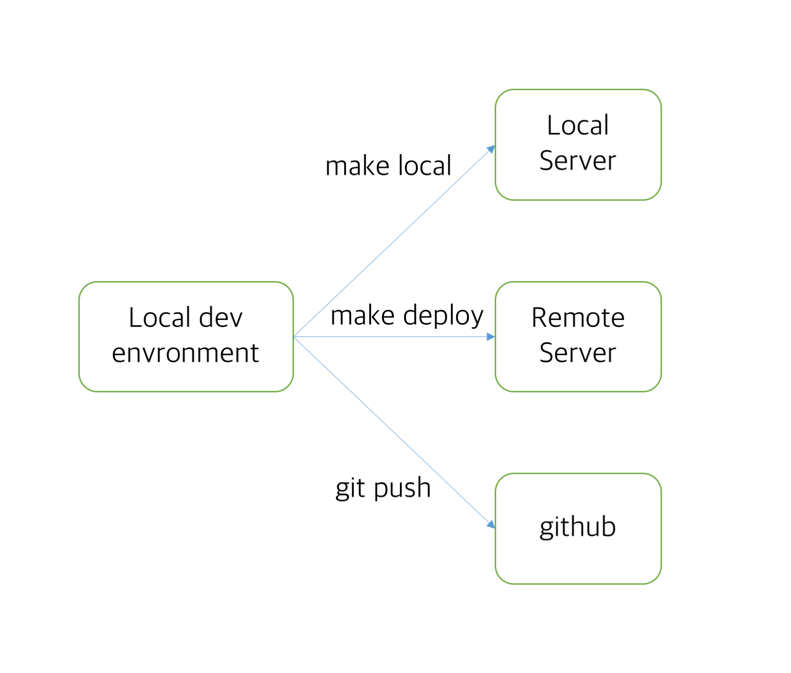

# Deployment System

Auto deployment system for terrace project.

When a commit occurs, `post-receive` hook catches the commit and execute updating procedure.

### Diagram

### Updating procedure

1. Rebuild terrace.
2. Start `terrace.service` of `systemd`
   1. Kill the server daemon
   2. Start new builded server daemon.

### References

 - [Git push deployment in 7 easy steps.md](https://gist.github.com/thomasfr/9691385)
 - [4 Ways to Kill a Process – kill, killall, pkill, xkill](https://www.thegeekstuff.com/2009/12/4-ways-to-kill-a-process-kill-killall-pkill-xkill/)
 - [Autostart using systemd](https://www.home-assistant.io/docs/autostart/systemd/)
