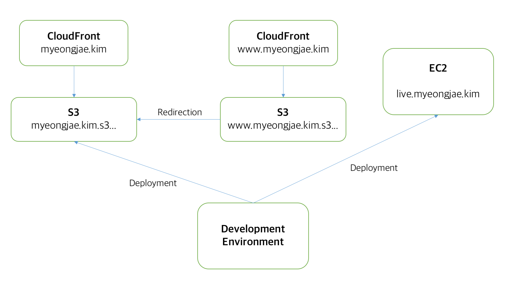

# The structure of AWS which my website is using

AWS (Amazon Web Service) is one of the most cutting-edge web and server hosting service. I used to use [Vultr](https://www.vultr.com) because it is cheaper than AWS. But many companies which I would like to work for are using or trying to use AWS, so I have migrated my server from Vultr to AWS. As learning AWS, I found a lot of modern techniques about server and app.

## Brief introduction of my AWS structure

The main page of my website is hosted by S3. You can access it by https://myeongjae.kim or https://www.myeongjae.kim. If you select https://www.myeongjae.kim, you will be redirected to https://myenogjae.kim.

https://cdn.myeongjae.kim is also a S3 service, but it can only be accessed by https://myeongjae.kim. Other people cannot use my resource storage.

https://live.myeongjae.kim is a real web server run on EC2. The web server is implemented with golang. The website that I would like to is not that complex, so I chose to develop my own web server not using nginx, apach, or Django.

Every service fully supports https protocol.

## Deployment

Once an update is made in development environment, the update will be deployed to EC2 and S3 (https://live.myeongjae.kim and https://myeongjae.kim).

## Redirecting

I used to use Cloudflare as a DNS server and a CDN service, but now I am using Route 53 as a DNS server and CloudFront as a CDN service. Redirecting is not a piece of cake because Route 53 does not support redirecting record in contrast to Cloudflare. There are some steps to achieve redirecting using Route 53

1. Create a S3 bucket and turn on static web hosting. There is a option whose name is 'Redirect requests'. Write a target url you want to redirect to.
2. (For using https) Create a CloudFront Distribution and its origin must be the bucket we have created in step 1. Request a SSL certificate as creating this distribution.
3. Create an A Type record and turn on Alias option of the record. The Alias target must be the address of the CloudFront distribution we created in step 2.

You can find more detailed explanation at [here](https://simonecarletti.com/blog/2016/08/redirect-domain-https-amazon-cloudfront/).

## Disallow other people from using my S3 for resources (hotlink)

If you visit https://myeongjae.kim/#/blog, you can see a photo of me that an octopus doll is on my head. Its url is https://cdn.myeongjae.kim/res/logo1.jpg, but if you try to get an image by putting this url to your web browser, you cannot see the image and will be redirected to my website.

The resources in my cdn(https://cdn.myeongjae.kim) only can be accessed through my website. This feature can be implemented using AWS WAF(Web Application Firewall) and AWS ACL(Access Control List)

1. Disallow every access to my S3.
2. Only allow accesses made by my websites.

You can find more detailed explanation at [here](https://aws.amazon.com/blogs/security/how-to-prevent-hotlinking-by-using-aws-waf-amazon-cloudfront-and-referer-checking/).

Below are other references.

https://docs.aws.amazon.com/AmazonCloudFront/latest/DeveloperGuide/private-content-restricting-access-to-s3.html

https://stackoverflow.com/questions/31680022/amazon-s3-bucket-policy-allow-only-one-domain-to-access-files

